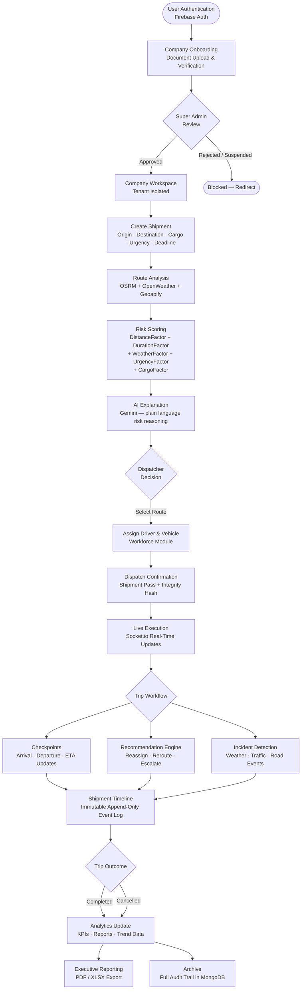

<div align="center">

# SentinelRoute

**Logistics Intelligence for Resilient Supply Chains**

*From shipment creation to dynamic rerouting and explainable dispatch decisions — all in one platform.*

[](https://nextjs.org)
[](https://react.dev)
[](https://www.typescriptlang.org)
[](https://tailwindcss.com)
[](https://ui.shadcn.com)
[](https://www.framer.com/motion/)
[](https://leafletjs.com)
[](https://recharts.org)

[](https://nodejs.org)
[](https://www.mongodb.com/atlas)
[](https://firebase.google.com)
[](https://socket.io)

[](https://www.openstreetmap.org)
[](https://project-osrm.org)
[](https://openweathermap.org/api)
[](https://deepmind.google/technologies/gemini)

[](https://zod.dev)
[](https://jwt.io)

[](https://vercel.com)
[](LICENSE)
[]()

---

*Built for smart supply chains, route reliability, and disruption resilience.*

</div>

---

## Executive Overview

SentinelRoute is an enterprise-grade logistics intelligence platform built on the Next.js App Router. It was designed from the ground up to replace the reactive, single-route dispatch model that has defined traditional Transport Management Systems for decades. Where legacy tools answer the question "what is the fastest path?", SentinelRoute answers a harder question: "what is the safest, most reliable, and most defensible dispatch decision — right now?"

The platform aggregates live data from road-network routing engines, real-time weather services, incident feeds, and historical corridor statistics, then runs every input through a deterministic, auditable risk engine before a dispatcher ever touches a button. Every route receives a composite risk score. Every dispatch decision is accompanied by a Gemini-powered AI explanation that translates raw scores into plain-language reasoning. Nothing is a black box.

SentinelRoute is built for multi-tenant enterprise operations. Every company onboards through a structured registration and document-verification workflow. Once approved, the company receives a fully isolated workspace — its shipments, drivers, vehicles, users, incidents, recommendations, and audit logs are never co-mingled with another tenant's data. The `companyId` tenant key is derived exclusively from the authenticated user's server-side record; it cannot be spoofed through request parameters or body fields.

The platform's real-time layer is powered by Socket.io, which delivers live shipment updates, presence awareness, operational feed changes, and recommendation events to every connected client without polling. When a dispatcher creates a shipment, every other authorized user in the same company room sees it appear on their screen within milliseconds. When a recommendation is generated or accepted, the shipment timeline reflects it instantly. When the operational health score changes, the dashboard updates without a page refresh.

Beyond individual shipments, SentinelRoute surfaces intelligence at the company level. The Command Center provides a unified view of active incidents, operational alerts, and live recommendations across all shipments. The Risk Center scores every active corridor. The Heatmap visualizes geographic incident density. Corridor Intelligence aggregates historical reliability, average delay, weather risk, festival risk, and incident density into a per-corridor health model. All of these feeds are tenant-scoped and updated in real time.

The workforce layer manages the full driver and vehicle lifecycle. Drivers have profiles with licence expiry tracking, assignment history, and audit logs. Vehicles carry insurance, permit, and fitness certificate expiry dates with automated 30-day warning indicators. Assignment between drivers and vehicles is enforced as a strict one-to-one relationship using MongoDB sessions for atomicity. Every create, update, suspend, assign, and role-change action generates an immutable audit record.

The recommendation engine generates structured, typed operational recommendations — reassign driver, change route, delay dispatch, increase monitoring, and more — with confidence scores, affected metrics, tradeoffs, and estimated impact. Each recommendation travels through a full lifecycle: generated, assigned, viewed, accepted, rejected, executed, completed. Every lifecycle transition is recorded on the shipment's immutable timeline.

The Executive Analytics layer provides company admins and operations managers with deep-dive reporting across shipments, fleet, drivers, risk trends, and predictive indicators. The platform exports PDF and XLSX reports and surfaces KPI cards, trend charts, and risk distribution visualizations derived from live MongoDB aggregations, not cached snapshots.

---

## Platform Highlights

| Capability | Description |
|---|---|
| **AI Powered** | Gemini generates a plain-language risk explanation for every shipment. Explainable AI — not a black box. |
| **Real-Time** | Socket.io delivers shipment events, presence updates, feed changes, and KPI updates to all connected clients. |
| **Multi-Tenant** | Complete company isolation. Every query is scoped by `companyId` derived server-side from the authenticated user. |
| **Operational Intelligence** | Incidents, alerts, corridor statistics, heatmaps, and risk center — all in a live, tenant-scoped view. |
| **Socket.io Event Bus** | Company rooms, entity rooms, and typed event channels for shipments, presence, feed, health, and KPIs. |
| **MongoDB Atlas** | Single source of truth. Indexed collections with tenant isolation enforced at the query level. |
| **Enterprise Security** | Firebase Auth, JWT verification, AES-256-GCM field encryption, SHA-256 integrity hashing, RBAC, IDOR protection. |
| **Explainable AI** | Every AI recommendation includes confidence scores, affected metrics, and tradeoff analysis. |
| **Decision Workspace** | Dispatchers review multi-route options with risk scores, AI reasoning, and structured recommendations before dispatch. |
| **Command Center** | Unified incident management with severity classification, priority, command status, and resolution tracking. |
| **Fleet Intelligence** | Vehicle profiles with insurance, permit, and fitness expiry tracking and automated warning indicators. |
| **Operational Feed** | Live feed of shipment events, risk changes, recommendations, and system alerts scoped to the company. |
| **Recommendation Engine** | Typed recommendations (Reassign Driver, Change Route, Delay Dispatch, etc.) with full lifecycle tracking. |
| **Risk Analytics** | Deterministic risk scoring using distance, duration, weather, urgency, and cargo sensitivity factors. |
| **Audit Logging** | Immutable audit records for every company event, shipment event, and workforce action. Never updated, never deleted. |
| **Heatmaps** | Geographic incident density visualization with Leaflet-based interactive map overlays. |
| **Corridor Intelligence** | Per-corridor historical reliability, average delay, weather risk, festival risk, and incident density. |
| **Predictive ETA** | Route confidence scoring derived from weather conditions, corridor volatility, and historical reliability. |
| **Driver Intelligence** | Driver profiles with licence expiry indicators, assignment history, operational status, and audit logs. |
| **Vehicle Intelligence** | Fleet records with document expiry tracking, assignment state, and full operational audit history. |

---

## The Problem

Modern logistics tools optimize for speed. They ignore reliability.

The fastest route fails more often than it should - and when it does, there's no intelligence to explain why or what to do next.

| Root Cause | Real-World Impact |
|---|---|
| Weather disruptions | Missed delivery windows, cargo damage |
| Traffic bottlenecks | Cascading ETA failures |
| Operational delays | Unplanned cost overruns |
| No risk visibility | Reactive decisions instead of proactive ones |
| Single-route dependency | No fallback when conditions change |

Logistics teams are left guessing. SentinelRoute changes that.

---

## The Solution

SentinelRoute generates multiple route options for every shipment and scores each one using a composite risk engine - before dispatch, not after failure.

Every route is evaluated across:

- Live traffic patterns and congestion signals
- Weather conditions along the full corridor
- Route stability and historical disruption data
- Cargo type sensitivity and urgency level
- Distance, ETA accuracy, and fuel exposure

The platform then recommends the optimal route with a clear AI-generated explanation - so dispatchers understand *why*, not just *what*.

---

## Why SentinelRoute is Different

| Capability | Traditional Tools | SentinelRoute |
|---|---|---|
| Route options | Single fastest path | Fastest · Balanced · Safest |
| Risk intelligence | None | Composite score per route |
| ETA reliability | Speed-based estimate | Risk-adjusted prediction |
| Disruption handling | Manual rerouting | Predictive alerts pre-dispatch |
| Decision transparency | None | Gemini-powered AI reasoning |
| Shipment memory | None | Full history + analytics |
| Cargo awareness | None | Sensitivity-adjusted scoring |
| Multi-factor scoring | None | Traffic + Weather + Disruption + Cargo |

---

## Core Features

**Route Intelligence**
- Multi-route generation - fastest, balanced, and safest options per shipment
- Dynamic risk scoring - composite 0–100 score per route, updated per analysis
- Weather disruption intelligence - live OpenWeather corridor sampling
- Live route intelligence map - interactive Leaflet map with route overlays

**AI & Decision Layer**
- Gemini-powered route reasoning - explainable AI rationale for every dispatch decision
- Smart rerouting engine - risk-aware route comparison with delta indicators
- Shipment Pass - structured dispatch authorization with integrity hash

**Operations & Analytics**
- Analytics dashboard - risk trends, route performance, cargo breakdown
- Real-time alerts - predictive warnings surfaced before dispatch
- Historical shipment insights - full audit trail per shipment

---

## Product Walkthrough


```
1. Authenticate          →  Firebase Auth (email / OAuth)
2. Create Shipment       →  Origin, destination, cargo type, vehicle, urgency, deadline
3. Generate Routes       →  OSRM routing + OpenWeather corridor analysis
4. Compare Options       →  Fastest / Balanced / Safest with risk scores
5. Review AI Reasoning   →  Gemini explains the recommendation
6. Confirm Dispatch      →  Shipment Pass generated with integrity hash
7. Monitor Live          →  Real-time status via Socket.io
8. Complete & Archive    →  Analytics updated, full audit trail stored
```

---

## System Architecture


---

## Platform Modules

SentinelRoute has completed eleven production modules. Each module builds strictly on top of the previous ones without modifying existing behavior.

---

### Module 1 — Authentication & Company Onboarding

**Purpose:** Establish the identity, tenancy, and authorization foundation for the entire platform.

**Major Features:**
- Firebase Authentication as the sole identity provider (`onAuthStateChanged`, ID token verification via Firebase Admin SDK)
- Company registration workflow with document upload (GST, PAN, insurance, transport licence, fleet insurance)
- Super Admin review portal — approve, reject, suspend, or reactivate company accounts
- Role-based access control with seven roles: `company_admin`, `super_admin`, `company_manager`, `operations_manager`, `fleet_manager`, `dispatcher`, `driver`
- Company status guards in `(app)/layout.tsx` — pending, rejected, suspended, and approved states each produce distinct routing behavior
- Immutable `CompanyAudit` records for every company lifecycle event
- Company settings with multilingual support (`language`, `supportedLanguages`, `fallbackLanguage`, `timezone`)
- User settings with per-user language preference and configurable risk thresholds

**Integration:** All subsequent modules derive `companyId` from the authenticated user's `UserRecord`. No module accepts `companyId` from request parameters.

**Outcome:** Every user operates within an isolated, approval-gated company workspace. The identity and tenancy contract is enforced at every API layer.

---

### Module 2 — Organization & Workforce Management

**Purpose:** Give approved companies the ability to manage their driver pool, vehicle fleet, and internal user accounts through a role-based hierarchy.

**Major Features:**
- Driver records with full profile: licence number and expiry, Aadhaar (AES-256 encrypted at rest), blood group, address, language preferences
- Vehicle records with registration, fuel type, capacity, insurance number, insurance/permit/fitness expiry dates
- Driver–vehicle assignment enforced as a strict one-to-one relationship using MongoDB sessions for atomicity
- Suspension cascade: suspending a driver automatically clears `assignedVehicleId` on the driver and `currentDriverId` on the vehicle in a single atomic session
- Soft-delete pattern: no driver or vehicle record is physically deleted; status transitions to `"inactive"`
- `ExpiryBadge` component with 30-day warning threshold — badge mode for tables, indicator mode for profile pages
- `WorkforceAudit` — immutable audit records for every driver, vehicle, and user management action
- Company Manager user management: invite users, assign roles, disable/activate accounts
- Self-modification guard: a Company Manager cannot modify their own role or disable their own account
- Workforce Dashboard API: live MongoDB aggregation for driver/vehicle counts, recent activity, and upcoming expirations

**Integration:** Workforce data is linked to shipments in Module 4. Driver and vehicle records carry forward-compatible `shipmentIds` and `trackingDeviceId` fields.

**Outcome:** Fleet and driver data is always current, auditable, and tenant-isolated. Assignment integrity is guaranteed by session-level atomicity.

---

### Module 3 — Operational Intelligence Platform

**Purpose:** Surface real-time operational awareness across incidents, alerts, recommendations, corridor health, and shipment communication.

**Major Features:**
- Incident management: create, classify, update, and resolve incidents with category, severity, affected radius, and logistics impact
- Command Center: company-scoped incident command with `commandStatus` lifecycle (open, investigating, mitigating, resolved)
- Operational alerts with typed categories: Weather, Traffic, Incident, Driver, Vehicle, Compliance, Route, Execution, Delay, Prediction
- Recommendation Engine: typed recommendations (`Reassign Driver`, `Replace Vehicle`, `Change Route`, `Delay Dispatch`, `Advance Dispatch`, `Increase Monitoring`, `Pause Shipment`, `Split Cargo`, `Escalate to Operations Manager`)
- Full recommendation lifecycle: generated → assigned → viewed → accepted → rejected → executed → completed → cancelled/expired
- Shipment timeline: immutable, append-only event stream per shipment covering 40+ typed event types
- Shipment communication channels: per-shipment message threads with text, system, image, and PDF message types
- Heatmap: geographic incident density visualization on an interactive Leaflet map
- Corridor Intelligence: per-corridor aggregation of historical reliability, average delay, weather/traffic/festival risk, and incident density
- Risk Center: company-wide risk scoring with alert severity distribution
- Operational health score with sub-components: driver availability, vehicle availability, route confidence, incident density, compliance score

**Integration:** Timeline events are created by shipment workflows, recommendation engine, and real-time socket events. The operational feed is delivered to all connected clients via Socket.io.

**Outcome:** Dispatchers and operations managers have a live, structured view of every risk factor affecting active shipments — before and during execution.

---

### Module 4 — Shipment Assignment & Fleet Operations

**Purpose:** Link the workforce layer to the shipment layer by enabling dispatcher-controlled driver and vehicle assignment with full audit trails.

**Major Features:**
- `ShipmentAssignment` records linking a shipment to a driver and vehicle with timestamps and active/inactive state
- Assignment API at `POST /api/shipments/[id]/assign` — validates driver and vehicle belong to the same company, checks availability, updates shipment record
- Shipment detail page shows assigned driver name, vehicle number, and assignment timestamp
- Driver and vehicle profile pages display assigned shipment context
- Fleet Operations page (`/fleet-ops`) showing active vehicle deployments
- Driver Operations page (`/driver-ops`) showing driver workload and operational status
- Cargo metadata fields on shipments: `cargoWeightKg`, `cargoVolumeM3`, `insuranceType`, `temperatureRequirement`, `priority`, `deadline`

**Integration:** Assignment data is used by the execution engine in Module 5 and surfaced in analytics in Modules 9 and 11.

**Outcome:** Every active shipment has a known driver and vehicle. Assignment history is maintained through the `ShipmentAssignment` collection.

---

### Module 5 — Route Intelligence & Execution Engine

**Purpose:** Add live trip execution tracking to active shipments with checkpoint management, location updates, and route deviation detection.

**Major Features:**
- `ShipmentExecution` records: trip status, current route, route version, driver location history (last 100 points), checkpoint progress
- Trip workflow transitions: pending → driving → paused → completed/cancelled
- Checkpoint system with arrival/departure tracking and ETA per checkpoint
- Driver location updates via `POST /api/execution/[id]/location`
- Checkpoint events via `POST /api/execution/[id]/checkpoint`
- Trip workflow transitions via `POST /api/execution/[id]/workflow`
- Active executions feed at `GET /api/execution/active`
- Geoapify autosuggest integration for location search in shipment creation
- Route Intelligence page (`/route-intelligence`) with corridor volatility and confidence scoring
- Route confidence scoring using weather confidence, incident density, traffic stability, and historical corridor reliability
- Extended route fields: `averageSpeed`, `trafficDelay`, `weatherSummary`, `roadIncidents`, `confidenceScore`, `predictionConfidence`, `historicalReliability`, `fuelEstimate`, `carbonEstimate`

**Integration:** Execution events are written to the shipment timeline. Location updates feed the heatmap and corridor statistics.

**Outcome:** Dispatchers have live visibility into active trips with structured checkpoint progress and deviation awareness.

---

### Module 6 — Recommendation Engine & Decision Workspace

**Purpose:** Automate operational decision support by generating, assigning, and tracking structured recommendations through a full lifecycle.

**Major Features:**
- Recommendation generation with type, reason, confidence, affected metrics, tradeoffs, and estimated impact
- Full lifecycle status machine: generated → assigned → viewed → accepted → rejected → executed → completed → cancelled → expired
- Recommendations API: `GET /api/intelligence/recommendations`, `PATCH /api/intelligence/recommendations/[id]`
- Timeline integration: every lifecycle transition appends a typed event to the shipment timeline
- Decision workspace UI showing active recommendations grouped by severity
- Recommendation sync over Socket.io — all company members see recommendation state changes in real time
- Recommendations analytics at `GET /api/analytics/recommendations`

**Integration:** Recommendations reference shipment, driver, and vehicle IDs. Lifecycle transitions are reflected on the shipment timeline and in the operational feed.

**Outcome:** Operations managers have a structured, auditable decision workflow. No recommendation is lost or untracked.

---

### Module 7 — Real-Time Platform

**Purpose:** Build a production-grade Socket.io event infrastructure that supports company rooms, entity rooms, presence tracking, and typed event channels.

**Major Features:**
- Company room management: clients join `company:{companyId}` on connect and re-join on reconnect
- Entity rooms for shipment-level collaboration: clients can join `entity:{shipmentId}` for per-shipment presence
- Presence tracking: `presence:updated`, `presence:entity:joined`, `presence:entity:left`, `presence:sync` events
- Live operational feed delivery: `feed:updated`, `health:updated`, `sync:refresh_feed`
- KPI push: `kpi:updated` event updates dashboard cards without polling
- Shipment events: `shipment:created`, `shipment:status`, `shipment:updated`
- `useSocket` hook with handler map, `on/off` lifecycle management, and `emit` capability
- Polling fallback: 30-second interval when `NEXT_PUBLIC_ENABLE_WEBSOCKET` is not set (Vercel / serverless)
- Token refresh and auth failure handling in the store's `fetchWithAuth` wrapper

**Integration:** Every module that mutates state emits a corresponding Socket.io event. The store handles all event types and dispatches to the reducer.

**Outcome:** All connected clients share a live, consistent view of operational state without requiring manual refreshes.

---

### Module 8 — Enterprise Collaboration

**Purpose:** Enable structured communication within shipment contexts through persistent message channels.

**Major Features:**
- `ShipmentChannel` records — one channel per shipment, created on first message
- `ShipmentMessage` records with sender type, sender role, message type (text, system, image, PDF), and read status
- Communication channel API under `/api/intelligence/shipments/[id]/`
- Role-typed senders: Dispatcher, Driver, Operations Manager, System
- Message history displayed on shipment detail pages
- System messages automatically generated for timeline events (dispatch, risk changes, recommendations)

**Integration:** Channels and messages are tenant-scoped by `companyId`. System messages are created by the recommendation engine and execution workflow.

**Outcome:** All shipment-level communication is captured, auditable, and available to authorized company users.

---

### Module 9 — Executive Analytics & Reporting

**Purpose:** Provide company admins and operations managers with deep-dive reporting and trend analysis across all operational dimensions.

**Major Features:**
- Analytics API suite with eleven endpoints: `/api/analytics/shipments`, `/api/analytics/fleet`, `/api/analytics/drivers`, `/api/analytics/risk`, `/api/analytics/operational`, `/api/analytics/predictions`, `/api/analytics/recommendations`, `/api/analytics/trends`, `/api/analytics/kpis`, `/api/analytics/company`, `/api/analytics/reports`
- Executive Summary page with tabbed sub-views: Shipments, Fleet, Drivers, Operational, Risk, Predictions, Recommendations
- KPI cards derived from live MongoDB aggregation queries
- Shipment volume chart (7-week trend), risk distribution pie chart, route preference breakdown
- Risk trend analysis with anomaly detection indicators
- Fleet utilization reporting: available vs assigned vs maintenance ratios
- Driver performance reporting: active vs inactive, assignment frequency, suspension history
- PDF and XLSX export via `jspdf`, `jspdf-autotable`, and `xlsx`
- Report engine in `src/lib/analytics/report-engine.ts`
- Role-gated: `company_admin`, `operations_manager`, and `super_admin` only

**Integration:** All analytics queries are scoped by `companyId`. Super Admin receives cross-company views.

**Outcome:** Leadership has a single, accurate view of operational performance without relying on manual data extraction.

---

### Module 10 — Operational Feed & Health Score

**Purpose:** Aggregate all operational signals into a unified company-level feed and health score that update in real time.

**Major Features:**
- Operational feed API at `GET /api/operational/feed` — aggregates recent incidents, alerts, recommendations, and shipment events into a time-ordered feed scoped to the company
- Operational health score API at `GET /api/operational/health` — computes a 0–100 score with sub-components: active shipments, average risk, driver availability, vehicle availability, incident density, route confidence, delayed shipments, compliance score
- `OperationalHealthScore` type with `status` labels: Excellent, Good, Fair, Poor, Critical
- Feed and health pushed via `feed:updated` and `health:updated` Socket.io events on state changes
- 30-second polling fallback for serverless deployments

**Integration:** The feed and health score are rendered on the dashboard and consumed by the Command Center.

**Outcome:** Every operational stakeholder has a continuously updated summary of company health without navigating multiple pages.

---

### Module 11 — Settings, User Preferences & Multilingual Foundation

**Purpose:** Give users and companies control over their operational defaults, notification preferences, and language settings.

**Major Features:**
- User settings API at `GET/PATCH /api/settings` — persists per-user preferences in MongoDB
- Settings fields: notification toggles (risk alerts, dispatch confirmation, disruptions, completion summary, weather warnings, analytics digest), risk thresholds (auto-flag, require-approval, auto-block), preferred route type, default vehicle type, dispatch confirmation window
- Per-user language preference stored on `UserRecord.preferredLanguage`
- Company language settings: `preferredLanguage`, `supportedLanguages`, `fallbackLanguage`
- Language update APIs: `PATCH /api/company/language`, `PATCH /api/user/language`
- `useI18nCompany` hook syncs the UI locale from the company/user language preference on app load
- Settings page (`/settings`) with Company Profile tab and User Preferences tab

**Integration:** Language preferences are consumed by all display layers. Risk thresholds from user settings influence the analytics dashboard's risk classification logic.

**Outcome:** Each user and company can configure the platform's behavior to match their operational context and regional preferences.

---

## Platform Workflow



---

## Operational Architecture

SentinelRoute's runtime is composed of several cooperating engines. Each has a clear responsibility boundary and communicates through well-defined interfaces.

### Event Dispatcher

The Socket.io server (`src/lib/socket-server.ts`) is initialized once per Node.js process. It maintains a single namespace and provides typed emit helpers (`emitShipmentCreated`, `emitShipmentUpdated`). On the client, `useSocket` manages a single connection instance with automatic reconnection and typed event handler registration.

Company rooms (`company:{companyId}`) are the primary scoping unit. When a user connects, the client emits `join:company` and the server places the socket into the company room. All broadcast events are emitted to the company room, ensuring tenant isolation at the transport layer.

### Operational Engine

The Operational Engine (`/api/operational/feed` and `/api/operational/health`) aggregates live state from the incidents, alerts, recommendations, and shipments collections into a feed and a health score. Feed items are time-ordered. The health score is computed from six sub-components and mapped to a five-tier label. Both are pushed to connected clients via Socket.io when state changes.

### Recommendation Engine

The Recommendation Engine generates typed `OperationalRecommendation` documents when risk conditions are detected. Each recommendation has a `type` (from a 10-value enum), `reason`, `confidence` (0–100), `affectedMetrics`, `tradeoffs`, `estimatedImpact`, and `severity`. The lifecycle state machine transitions the recommendation from `generated` through to `completed` or `expired`. Every transition is written to the shipment timeline.

### Risk Engine

The Risk Engine (`src/lib/risk.ts`) is deterministic and stateless. Given `(distanceKm, durationHours, weatherFactor, deadline, cargoType)`, it always produces the same `riskScore` and `riskLevel`. No random values, no AI involvement in the scoring formula. Scores are reproducible and auditable by design.

```
riskScore = distanceFactor + durationFactor + weatherFactor + urgencyFactor + cargoFactor

distanceFactor  = distanceKm × 0.02
durationFactor  = durationHours × 0.5
urgencyFactor   = 5 (<24 h) | 3 (24–72 h) | 1 (≥72 h)
cargoFactor     = 4 (fragile) | 1 (standard)
```

### Health Score

The `OperationalHealthScore` aggregates six real-time inputs — active shipments, average risk, driver availability, vehicle availability, incident density, and route confidence — into a single 0–100 score with a five-tier label: Excellent, Good, Fair, Poor, Critical.

### Dependency Graph

The module dependency chain is strictly layered. Higher modules consume lower module APIs but never modify lower module code.

```
Module 1 (Auth + Company)
  └── Module 2 (Workforce)
        └── Module 4 (Assignment)
              └── Module 5 (Execution)
  └── Module 3 (Operational Intelligence)
        └── Module 6 (Recommendations)
              └── Module 7 (Real-Time)
                    └── Module 8 (Collaboration)
  └── Module 9 (Analytics)
  └── Module 10 (Operational Feed)
  └── Module 11 (Settings)
```

### Socket Layer

The Socket.io server runs on a custom Node.js HTTP server (`server.ts`) in development. In production on Vercel, the WebSocket path `/api/socket` is proxied. The client uses a singleton socket instance across the application lifetime and falls back to 30-second polling when the WebSocket is unavailable.

### Store

`StoreContext` (`src/lib/store.tsx`) is a `useReducer`-based client state container. It holds shipments, pending shipment, operational feed, operational health, presence map, and KPI data. All mutations flow through API calls. Socket events trigger reducer dispatches directly — no optimistic updates. The store includes resilient `fetchWithAuth` with a 9-second timeout, single retry on network errors and 5xx responses, and token refresh on 401.

---

## Real-Time Collaboration

SentinelRoute treats real-time state as a first-class concern. Every mutation that matters is propagated to all authorized clients without polling.

### Presence

Each authenticated user is tracked in the presence map keyed by `userId`. Presence events carry `userId`, `status` (online/offline), `role`, and optional `entityId` for shipment-level presence. The store handles `presence:updated`, `presence:entity:joined`, `presence:entity:left`, and `presence:sync` events.

### Company Rooms

When a user's connection is established (or re-established), the client emits `join:company` with `companyId`, `userId`, and `role`. The server registers the socket in the company's Socket.io room. All company-scoped events are broadcast to this room. Cross-company leakage at the transport layer is structurally impossible.

### Entity Rooms

Shipment-level collaboration uses entity rooms (`entity:{shipmentId}`). Users viewing a shipment detail page join the entity room, making their presence visible to other viewers of the same shipment.

### Timeline

The shipment timeline is an append-only, immutable event log. Every operational event — dispatch, status change, weather update, incident detection, recommendation lifecycle transition, driver message, system alert — is written as a `ShipmentTimelineEvent` with a typed `TimelineEventType`, description, source, confidence score, and affected metrics. The timeline is never edited or deleted.

### Messages

Shipment channels support multi-participant messaging with typed senders (Dispatcher, Driver, Operations Manager, System) and message types (text, system, image, PDF). System messages are auto-generated by workflow transitions.

### Command Center

The Command Center (`/command-center`) surfaces all active incidents and operational alerts across the company. It provides a unified view for incident response coordination with command status lifecycle management.

### Decision Workspace

Before confirming a dispatch, the dispatcher reviews three route options side by side with risk scores, AI explanations, and any active recommendations. The Decision Workspace receives live recommendation updates via Socket.io so the view reflects the latest operational intelligence at the moment of decision.

### Operational Feed

The live operational feed is a time-ordered aggregation of recent incidents, alerts, recommendations, and shipment events. It is pushed to connected clients via `feed:updated` events and rendered on the dashboard.

### Live Collaborators

The presence map exposed by `StoreContext` enables the UI to show live collaborators — other users currently viewing the same entity or connected to the same company room.

### Recommendation Sync

When a recommendation is generated, assigned, accepted, or rejected, a Socket.io event propagates the state change to all connected company members. Dispatchers and operations managers always see the current lifecycle status of every recommendation without refreshing.

---

## AI Intelligence Pipeline

SentinelRoute combines deterministic risk scoring with AI-generated reasoning. The two layers are kept strictly separate: the risk score is computed before Gemini is called, and Gemini's output never influences the score.

### Data Inputs

| Source | Role |
|---|---|
| OSRM | Road-network routing — distance, duration, and GeoJSON geometry |
| OpenWeather | Weather scoring at 5 evenly spaced points along the route geometry |
| Geoapify | Address autosuggest and coordinate resolution for origin/destination |
| Historical Corridor Data | Reliability, average delay, and incident density per corridor |
| Incidents Collection | Active incidents within affected radius of the route |
| Festival Data | Festival calendar seeded to MongoDB via `scripts/seed-festivals.ts` |

### Weather Sampling

The `WeatherSampler` selects exactly 5 evenly spaced indices from the OSRM route geometry's coordinate array and fetches the OpenWeather current conditions for each in parallel. Condition strings are mapped to numeric scores: Clear → 0, Clouds → 1, Rain → 3, Thunderstorm → 5. The arithmetic mean of the 5 scores is the `weatherFactor`. Individual failures fall back to score 1.

### Risk Computation

The Risk Engine computes `riskScore` deterministically from `distanceFactor`, `durationFactor`, `weatherFactor`, `urgencyFactor`, and `cargoFactor`. Level thresholds: ≤10 Low, ≤20 Medium, >20 High.

### Gemini Integration

After the risk score is computed, the API calls `generateExplanation()` exactly once, passing `distanceKm`, `durationHours`, `weatherFactor`, `riskScore`, `riskLevel`, and `deadline`. The model generates a 2–3 sentence logistics risk summary. On HTTP 429, the API waits 30 seconds and retries once. On double failure, the fallback string `"AI explanation unavailable. Showing system-generated reasoning."` is stored on the shipment.

### Explainable AI

Every recommendation from the Recommendation Engine includes `reason`, `confidence`, `affectedMetrics`, `tradeoffs`, and `estimatedImpact`. No recommendation is surfaced without a human-readable explanation of what drove it and what the tradeoffs are.

---

## Tech Stack

SentinelRoute is built with a lean prototype stack optimized for rapid execution, real-world testing, and low operational cost.  
Its architecture is intentionally modular, allowing a direct upgrade path into the Google ecosystem for enterprise-scale logistics intelligence.

---

### Current Prototype Stack

| Layer | Technologies | Role |
|---|---|---|
| **Frontend** | Next.js, TypeScript, Tailwind CSS, Shadcn UI, Framer Motion | High-performance responsive web platform |
| **Maps & Routing** | Leaflet, React-Leaflet, OpenStreetMap, OSRM, Nominatim | Route visualization, geocoding, dynamic path generation |
| **Backend** | Next.js API Routes, Node.js | Shipment workflows, route orchestration, analytics APIs |
| **Database** | MongoDB Atlas | Shipment records, route history, operational insights |
| **Authentication** | Firebase Authentication, Firebase Admin SDK | Secure user login, Google Sign-In, session control |
| **AI Layer** | Google Gemini API | Route reasoning, explainable recommendations, decision support |
| **Real-Time** | Socket.io | Live shipment updates, route alerts, instant notifications |
| **Analytics** | Recharts | Operational dashboards, trend intelligence |
| **Security** | Zod, JWT, AES-256-GCM, SHA-256 | Validation, token security, encrypted fields, audit integrity |
| **Deployment** | Vercel | Fast global deployment for prototype and MVP stage |

---

### Google Ecosystem Scale-Up Roadmap

SentinelRoute is designed to transition into a Google-native logistics SaaS platform capable of serving enterprise fleets, high shipment volumes, and multi-region operations.

| Layer | Google Ecosystem Upgrade | Strategic Value |
|---|---|---|
| **Cloud Platform** | Google Cloud Platform | Unified enterprise infrastructure |
| **Compute** | Cloud Run | Auto-scaling containerized backend services |
| **API Management** | API Gateway | Secure, monitored external integrations |
| **Database** | Firestore + BigQuery | Real-time operational data + large-scale analytics |
| **Maps Intelligence** | Google Maps Platform | Premium routing, traffic intelligence, ETA precision |
| **AI & Prediction** | Gemini + Vertex AI | Delay prediction, optimization models, decision automation |
| **Storage** | Google Cloud Storage | Documents, shipment proofs, reports, media |
| **Streaming Data** | Pub/Sub | Real-time fleet events and logistics signals |
| **Monitoring** | Cloud Logging, Cloud Monitoring | Production observability and alerting |
| **Identity & Security** | Firebase Auth + IAM + Secret Manager | Enterprise-grade access control and secret management |
| **Global Scale** | Multi-region deployment + CDN | Low-latency global logistics operations |
| **CI/CD** | Cloud Build + GitHub Actions | Automated testing and production releases |

---

## Security Architecture

Security is applied at every layer — from identity to data storage to transport.

### Identity & Authentication

- Firebase Authentication is the sole identity provider. The `onAuthStateChanged` listener blocks all protected UI until the auth state resolves.
- Every API route verifies the Firebase ID token from the `Authorization: Bearer <token>` header using the Firebase Admin SDK.
- On 401, the client-side store force-refreshes the token and retries once. On second 401, the user is signed out.

### Role-Based Access Control

Seven roles are defined: `company_admin`, `super_admin`, `company_manager`, `operations_manager`, `fleet_manager`, `dispatcher`, `driver`. Role is stored server-side in the `UserRecord` MongoDB document and never derived from client input.

Role matrix enforcement is handled by `requireWorkforceRead`, `requireWorkforceWrite`, and `requireUserMgmt` helpers in `src/lib/auth-helpers.ts`.

### Tenant Isolation

`companyId` is resolved exclusively from the authenticated user's `UserRecord`. No API route accepts `companyId` from the request body or query parameters. Every MongoDB query in multi-tenant collections filters by `companyId`.

### IDOR Protection

Driver and vehicle detail endpoints verify that the fetched document's `companyId` matches the requesting user's `companyId`. Mismatches return HTTP 403. Cross-company resource access is structurally blocked.

### Field-Level Encryption

`aadhaarNumber` on `Driver` records is encrypted at rest using AES-256-GCM before MongoDB storage. Non-manager roles receive the value masked as `"****"` in API responses.

### Input Validation

Zod schemas validate every inbound API payload before any downstream logic executes. Validation failures return HTTP 400 with field-level error messages. OSRM, OpenWeather, Gemini, and MongoDB are never called when validation fails.

### Integrity Hashing

The Shipment Pass includes a SHA-256 hash of the route decision data computed at dispatch time. The hash is tamper-evident by design.

### Audit Logging

`CompanyAudit` and `WorkforceAudit` records are insert-only. No API endpoint updates or deletes audit records. The `workforce_audits` collection has no update or delete paths anywhere in the codebase.

### MongoDB Indexes

All collections have compound indexes that enforce uniqueness (`shipmentId`, `driverId`, `vehicleId`, `auditId`) and support tenant-scoped queries (`companyId` prefix on all workforce indexes).

---

## Risk Scoring Engine

Every route receives a composite risk score computed as:

```
riskScore = (
  traffic    × 0.30 +
  weather    × 0.30 +
  disruption × 0.25 +
  cargo      × 0.15
) × urgencyMultiplier
```

**Inputs**

| Factor | Source | Weight |
|---|---|---|
| Traffic congestion | OSRM duration vs static ETA | 30% |
| Weather severity | OpenWeather corridor sampling | 30% |
| Route disruption | Distance + delay ratio + warnings | 25% |
| Cargo sensitivity | Type-based lookup (Pharma, Cold Chain, Electronics) | 15% |
| Urgency multiplier | Standard 1.0× · Priority 1.2× · Critical 1.45× | Applied last |

**Output:** `low` · `medium` · `high` · `critical`

Each route also receives a SHA-256 integrity hash at analysis time - tamper-evident by design.

---

## Enterprise Features Matrix

| Capability | SentinelRoute | Traditional TMS | Basic GPS Platform | Manual Dispatch |
|---|:---:|:---:|:---:|:---:|
| Multi-route generation | Yes | Rarely | No | No |
| AI-powered explanations | Yes | No | No | No |
| Real-time risk scoring | Yes | No | No | No |
| Weather corridor sampling | Yes | No | No | No |
| Predictive ETA | Yes | Limited | No | No |
| Multi-tenant isolation | Yes | Varies | No | N/A |
| Role-based access control | Yes (7 roles) | Limited | No | No |
| Immutable audit log | Yes | Sometimes | No | No |
| Driver/vehicle lifecycle | Yes | Sometimes | No | No |
| Assignment atomicity | Yes | No | No | No |
| Recommendation engine | Yes | No | No | No |
| Recommendation lifecycle | Yes | No | No | No |
| Incident management | Yes | Sometimes | No | No |
| Corridor intelligence | Yes | No | No | No |
| Heatmap visualization | Yes | No | Limited | No |
| Live presence tracking | Yes | No | No | No |
| Shipment communication | Yes | Sometimes | No | No |
| Executive analytics | Yes | Sometimes | No | No |
| PDF/XLSX export | Yes | Sometimes | No | No |
| Document verification | Yes | Sometimes | No | No |
| Field-level encryption | Yes | Varies | No | No |
| Socket.io real-time | Yes | No | No | No |
| Graceful degradation | Yes | Varies | No | N/A |
| Serverless compatible | Yes | No | Varies | N/A |

---

## System Capabilities

<details>
<summary>View full capability checklist (100+ capabilities)</summary>

### AI & Intelligence
- [x] Gemini AI explanation per shipment
- [x] Explainable recommendation engine
- [x] Confidence scores on all AI outputs
- [x] Weather corridor sampling (5 parallel OpenWeather calls)
- [x] Deterministic, auditable risk scoring
- [x] Route confidence scoring
- [x] Corridor volatility scoring
- [x] Predictive ETA with confidence interval
- [x] Festival risk factor
- [x] Historical corridor reliability scoring
- [x] Incident density scoring
- [x] Traffic stability scoring

### Operations
- [x] Multi-route generation (fastest, balanced, safest)
- [x] Shipment creation pipeline with 11-step processing
- [x] Shipment Pass with SHA-256 integrity hash
- [x] Shipment status lifecycle (draft, active, at-risk, completed, cancelled)
- [x] Trip execution workflow (pending, driving, paused, completed, cancelled)
- [x] Checkpoint management with arrival/departure tracking
- [x] Route deviation detection
- [x] Live driver location updates
- [x] Operational health score
- [x] Operational feed aggregation
- [x] Command Center with incident command lifecycle
- [x] Risk Center with company-wide risk scoring
- [x] Corridor Intelligence with historical aggregations
- [x] Heatmap with geographic incident density

### Fleet
- [x] Vehicle registration with full document management
- [x] Insurance, permit, and fitness expiry tracking
- [x] 30-day expiry warning indicators
- [x] Vehicle status lifecycle (available, assigned, maintenance, inactive)
- [x] Soft delete — no vehicle record is ever destroyed
- [x] Fleet Operations dashboard
- [x] Vehicle profile with audit history
- [x] Operational status tracking (In Transit, Maintenance, etc.)
- [x] Vehicle–driver assignment with atomic session writes

### Drivers
- [x] Driver profiles with full personal, licence, and contact information
- [x] Licence expiry tracking with colour-coded indicators
- [x] Aadhaar encryption at rest (AES-256-GCM)
- [x] Aadhaar masking for non-manager roles
- [x] Driver status lifecycle (active, inactive, suspended)
- [x] Suspension cascade unassigns vehicle atomically
- [x] Driver Operations dashboard
- [x] Driver profile with audit history
- [x] Language preferences per driver
- [x] Driver self-view guard (drivers see only their own profile)

### Shipments
- [x] Unique SR-XXXX shipment ID with uniqueness loop
- [x] Full coordinate-aware origin and destination via Geoapify
- [x] Cargo metadata (weight, volume, temperature, insurance type)
- [x] Driver and vehicle assignment on shipments
- [x] Shipment timeline — immutable, 40+ event types
- [x] Shipment communication channels
- [x] Shipment detail page with risk panel
- [x] Status update via PATCH with socket broadcast

### Security
- [x] Firebase Authentication (email + Google)
- [x] Firebase Admin SDK token verification on every API route
- [x] Token refresh on 401 with sign-out on second failure
- [x] Role-based access control (7 roles)
- [x] Tenant isolation via companyId from server-side UserRecord
- [x] IDOR protection on driver/vehicle detail endpoints
- [x] Zod validation on all API inputs
- [x] AES-256-GCM field encryption for sensitive data
- [x] SHA-256 route integrity hashing
- [x] Immutable audit logs (insert-only, no update/delete)
- [x] Self-modification guard for user management
- [x] Super Admin read-only on company workforce data

### Analytics
- [x] Eleven analytics API endpoints
- [x] Shipment volume trend (7-week chart)
- [x] Risk distribution (pie chart)
- [x] Route preference breakdown
- [x] Fleet utilization reporting
- [x] Driver performance reporting
- [x] KPI cards derived from live aggregations
- [x] PDF export (jsPDF + jspdf-autotable)
- [x] XLSX export (xlsx)
- [x] Executive summary with tabbed sub-views
- [x] Predictions analytics
- [x] Recommendations analytics

### Collaboration & Realtime
- [x] Socket.io company rooms
- [x] Socket.io entity rooms (per-shipment)
- [x] Live presence tracking
- [x] Operational feed via Socket.io
- [x] Health score via Socket.io
- [x] KPI push via Socket.io
- [x] Shipment event broadcast
- [x] Recommendation state sync
- [x] 30-second polling fallback for serverless
- [x] Automatic reconnection with re-join on reconnect

### Admin
- [x] Super Admin company review portal
- [x] Approve / reject / suspend / reactivate companies
- [x] Admin dashboard with platform-wide statistics
- [x] Admin audit log
- [x] Cross-company operational read for Super Admin
- [x] Seed super admin utility API
- [x] Platform health API

</details>

---

## Project Structure

```
sentinelroute/
├── src/
│   ├── app/
│   │   ├── (app)/                        # Protected app shell — auth + company guards
│   │   │   ├── layout.tsx                # Auth guard, company status routing, app shell
│   │   │   ├── dashboard/                # Main dashboard — KPIs, shipment feed
│   │   │   ├── shipments/                # Shipment list + detail pages
│   │   │   │   └── [shipmentId]/         # Individual shipment detail + timeline
│   │   │   ├── create-shipment/          # Shipment creation form with Geoapify
│   │   │   ├── routes/                   # Route comparison Decision Workspace
│   │   │   ├── route-intelligence/       # Corridor intelligence and route scoring
│   │   │   ├── analytics/                # Operational analytics dashboard
│   │   │   ├── workforce/                # Workforce management hub
│   │   │   │   ├── drivers/              # Driver list + profile pages
│   │   │   │   ├── vehicles/             # Vehicle list + profile pages
│   │   │   │   └── users/                # Company user management
│   │   │   ├── fleet-ops/                # Fleet Operations overview
│   │   │   ├── driver-ops/               # Driver Operations overview
│   │   │   ├── command-center/           # Incident command + operational alerts
│   │   │   ├── company/
│   │   │   │   └── intelligence/         # Risk Center, Incidents, Heatmap, Corridors
│   │   │   ├── executive/                # Executive analytics sub-views
│   │   │   └── settings/                 # User + company settings
│   │   ├── api/
│   │   │   ├── shipments/                # GET, POST, PATCH shipments + assignment
│   │   │   ├── analyze-routes/           # Route analysis pipeline
│   │   │   ├── execution/                # Trip execution workflow + location + checkpoints
│   │   │   ├── intelligence/             # Incidents, alerts, recommendations, corridors, heatmap
│   │   │   ├── operational/              # Feed + health score APIs
│   │   │   ├── workforce/                # Drivers, vehicles, users, dashboard, audits
│   │   │   ├── analytics/                # 11 analytics endpoints + report engine
│   │   │   ├── company/                  # Registration, documents, settings, language
│   │   │   ├── admin/                    # Company management, audit, platform health
│   │   │   ├── settings/                 # User settings
│   │   │   ├── ai-insight/               # On-demand AI insight endpoint
│   │   │   ├── geoapify/                 # Address autosuggest proxy
│   │   │   ├── user/                     # User language preference
│   │   │   └── health/                   # Platform health check
│   │   ├── auth/                         # Sign-in + sign-up pages
│   │   ├── company/                      # Company onboarding flow pages
│   │   ├── admin/                        # Super Admin portal pages
│   │   └── layout.tsx                    # Root layout — providers
│   ├── lib/
│   │   ├── types.ts                      # Single source of truth for all types
│   │   ├── mongodb.ts                    # MongoDB client singleton + index setup
│   │   ├── schemas.ts                    # Zod validation schemas
│   │   ├── osrm.ts                       # OSRM routing client
│   │   ├── weather.ts                    # WeatherSampler — 5-point parallel fetch
│   │   ├── risk.ts                       # Deterministic RiskEngine
│   │   ├── gemini.ts                     # Gemini AI client with retry logic
│   │   ├── socket-server.ts              # Socket.io server singleton
│   │   ├── socket-client.ts              # Socket.io client hook
│   │   ├── store.tsx                     # useReducer-based client state
│   │   ├── auth-context.tsx              # Firebase Auth context
│   │   ├── company-context.tsx           # Company + UserRecord context
│   │   ├── auth-helpers.ts               # Role matrix + API auth helpers
│   │   ├── firebase.ts                   # Firebase Auth only (no Firestore)
│   │   ├── firebase-admin.ts             # Firebase Admin SDK singleton
│   │   ├── audit.ts                      # Company audit helper
│   │   ├── workforce-audit.ts            # Workforce audit helper (insert-only)
│   │   ├── logger.ts                     # Structured server-side logger
│   │   ├── time.ts                       # UTC time utilities
│   │   ├── utils.ts                      # Risk label, cn, and general utilities
│   │   └── analytics/
│   │       └── report-engine.ts          # PDF/XLSX report generation
│   ├── components/
│   │   ├── layout/
│   │   │   ├── AppSidebar.tsx            # Desktop sidebar + mobile nav
│   │   │   ├── AppHeader.tsx             # Top bar with user menu
│   │   │   └── PageTransition.tsx        # Framer Motion page transitions
│   │   ├── shipment/                     # Shipment-specific components
│   │   │   ├── ShipmentRiskPanel.tsx     # Risk score panel with breakdown
│   │   │   ├── ShipmentPass.tsx          # Dispatch authorization card
│   │   │   └── RouteCard.tsx             # Route option comparison card
│   │   ├── workforce/                    # Workforce management components
│   │   │   ├── DriverForm.tsx            # Add/edit driver dialog
│   │   │   ├── DriverTable.tsx           # Driver list with actions
│   │   │   ├── VehicleForm.tsx           # Add/edit vehicle dialog
│   │   │   ├── VehicleTable.tsx          # Vehicle list with actions
│   │   │   ├── AssignDriverModal.tsx     # Driver selection for vehicle assignment
│   │   │   ├── UserForm.tsx              # Invite user dialog
│   │   │   ├── UserTable.tsx             # Company users with role management
│   │   │   └── ExpiryBadge.tsx           # 30-day expiry warning badge/indicator
│   │   └── ui/                           # Shadcn UI primitive components
│   └── hooks/                            # Custom React hooks
│       ├── use-socket.ts                 # Socket.io connection and event management
│       └── use-i18n-company.ts           # Company/user language sync hook
├── scripts/
│   └── seed-festivals.ts                 # Festival calendar seeder for risk scoring
├── server.ts                             # Custom Node.js HTTP + Socket.io server
├── next.config.ts                        # Next.js configuration
├── tailwind.config.ts                    # Tailwind CSS configuration
├── tsconfig.json                         # TypeScript configuration (strict: true)
├── eslint.config.mjs                     # ESLint configuration
├── .env.example                          # Environment variable template
└── firestore.indexes.json                # Firestore index definitions (legacy reference)
```

---

## Database Design

SentinelRoute uses MongoDB Atlas as its sole persistent data store. All collections are scoped by `companyId` for tenant isolation.

### Collections

| Collection | Purpose | Key Indexes |
|---|---|---|
| `shipments` | Shipment records with route, risk, and assignment data | `shipmentId` (unique), `companyId`, `createdAt` (desc), `status` |
| `companies` | Company profiles with status, trust metrics, and settings | `companyId` (unique), `status` |
| `users` | UserRecord linking Firebase UID to company and role | `userId` (unique), `companyId` |
| `company_documents` | Company verification documents (Base64 encoded) | `companyId`, `documentId` (unique) |
| `company_audits` | Immutable company lifecycle events | `companyId`, `timestamp` (desc) |
| `company_settings` | Per-company operational and language settings | `companyId` (unique) |
| `user_settings` | Per-user notification and risk threshold preferences | `userId` (unique) |
| `drivers` | Driver records with licence and assignment data | `driverId` (unique), `companyId`, `companyId+status`, `companyId+licenseExpiry` |
| `vehicles` | Vehicle records with document expiry data | `vehicleId` (unique), `companyId`, `companyId+status`, expiry date indexes |
| `company_users` | User-to-company role bindings | `companyId+userId` (unique), `userId` |
| `workforce_audits` | Immutable workforce action records | `auditId` (unique), `companyId+timestamp` (desc), `companyId+targetId` |
| `incidents` | Operational incidents with geographic coordinates | `companyId`, `severity`, `startTime` |
| `shipment_timeline` | Immutable per-shipment event log | `shipmentId+companyId`, `timestamp` (desc) |
| `recommendations` | Typed operational recommendations with lifecycle | `shipmentId`, `companyId`, `lifecycleStatus` |
| `alerts` | Operational alerts with category and severity | `companyId`, `timestamp` (desc) |
| `corridors` | Historical corridor statistics | `origin+destination`, `companyId` |
| `ship_channels` | Per-shipment communication channel records | `shipmentId` (unique), `companyId` |
| `messages` | Shipment messages with sender type and read status | `channelId`, `timestamp` (desc) |
| `executions` | Active trip execution state with location history | `shipmentId` (unique), `companyId` |
| `assignments` | Driver-vehicle-shipment assignment history | `shipmentId`, `companyId`, `active` |
| `festivals` | Festival calendar for route risk scoring | `startDate`, `affectedStates` |

### Tenant Isolation Pattern

Every collection that stores company-scoped data uses `companyId` as the first field in every compound index. All API handlers resolve `companyId` from the server-side `UserRecord` and prepend `{ companyId }` to every MongoDB filter. `$project` stages in aggregations never expose cross-company documents.

### Immutability Pattern

`company_audits` and `workforce_audits` are insert-only collections. No API route provides an update or delete path for these collections. MongoDB does not enforce this at the storage level, but the application layer provides no mutation endpoints.

### Session Atomicity

Driver–vehicle assignment operations use MongoDB sessions (`startSession()` → `withTransaction()`) to ensure both the `drivers` and `vehicles` documents are updated atomically. If either write fails, the session rolls back both operations.

---

## API Overview

All API routes return responses in the envelope format `{ success: true, data: ... }` or `{ success: false, error: string }`. All routes require a valid Firebase ID token in the `Authorization: Bearer <token>` header unless noted.

### Authentication & Company

| Method | Path | Description |
|---|---|---|
| POST | `/api/company/register` | Register a new company |
| POST | `/api/company/submit` | Submit company for verification |
| GET | `/api/company/me` | Get current user's company and UserRecord |
| POST | `/api/company/documents` | Upload a verification document |
| PATCH | `/api/company/language` | Update company language settings |
| GET/PATCH | `/api/settings` | Get or update user settings |
| PATCH | `/api/user/language` | Update user language preference |

### Shipments

| Method | Path | Description |
|---|---|---|
| GET | `/api/shipments` | List all shipments for the company |
| POST | `/api/shipments` | Create a shipment (full 11-step pipeline) |
| GET | `/api/shipments/[id]` | Get a single shipment |
| PATCH | `/api/shipments/[id]` | Update shipment status |
| POST | `/api/shipments/[id]/assign` | Assign driver and vehicle to a shipment |

### Workforce

| Method | Path | Description |
|---|---|---|
| GET/POST | `/api/workforce/drivers` | List or create drivers |
| GET/PATCH/DELETE | `/api/workforce/drivers/[id]` | Get, update, or soft-delete a driver |
| GET/POST | `/api/workforce/vehicles` | List or create vehicles |
| GET/PATCH/DELETE | `/api/workforce/vehicles/[id]` | Get, update, or soft-delete a vehicle |
| GET/POST | `/api/workforce/users` | List or invite company users |
| GET/PATCH | `/api/workforce/users/[id]` | Get or update a company user |
| GET | `/api/workforce/dashboard` | Workforce summary statistics |
| GET | `/api/workforce/audits` | Workforce audit log |

### Operational Intelligence

| Method | Path | Description |
|---|---|---|
| GET/POST | `/api/intelligence/incidents` | List or create incidents |
| GET/PATCH | `/api/intelligence/incidents/[id]` | Get or update an incident |
| GET/POST | `/api/intelligence/alerts` | List or create operational alerts |
| PATCH | `/api/intelligence/alerts/[id]` | Acknowledge or resolve an alert |
| GET | `/api/intelligence/recommendations` | List recommendations |
| PATCH | `/api/intelligence/recommendations/[id]` | Update recommendation lifecycle |
| GET | `/api/intelligence/corridors` | Get corridor statistics |
| GET | `/api/intelligence/heatmap` | Get incident heatmap data |
| GET | `/api/intelligence/kpis` | Get operational KPIs |
| GET | `/api/intelligence/audit` | Get intelligence audit log |
| GET | `/api/operational/feed` | Get live operational feed |
| GET | `/api/operational/health` | Get operational health score |

### Analytics

| Method | Path | Description |
|---|---|---|
| GET | `/api/analytics/shipments` | Shipment analytics and trends |
| GET | `/api/analytics/fleet` | Fleet utilization analytics |
| GET | `/api/analytics/drivers` | Driver performance analytics |
| GET | `/api/analytics/risk` | Risk trend analytics |
| GET | `/api/analytics/operational` | Operational performance analytics |
| GET | `/api/analytics/predictions` | Prediction accuracy analytics |
| GET | `/api/analytics/recommendations` | Recommendation adoption analytics |
| GET | `/api/analytics/trends` | Multi-dimensional trend data |
| GET | `/api/analytics/kpis` | Company KPI summary |
| GET | `/api/analytics/company` | Company-level analytics (Super Admin) |
| GET | `/api/analytics/reports` | Generate and export reports |

### Execution

| Method | Path | Description |
|---|---|---|
| GET | `/api/execution/active` | List active trip executions |
| GET/POST | `/api/execution/[id]` | Get or create a trip execution |
| POST | `/api/execution/[id]/location` | Update driver location |
| POST | `/api/execution/[id]/checkpoint` | Record checkpoint arrival/departure |
| POST | `/api/execution/[id]/workflow` | Transition trip workflow state |

---

## Performance Characteristics

### Startup

The Next.js App Router is used exclusively. The custom Node.js server (`server.ts`) initializes the Socket.io server once per process. The MongoDB client is a singleton that reuses connections across hot reloads in development via a global variable guard.

### Latency

- Route analysis (`POST /api/analyze-routes`) runs OSRM routing and 5 parallel OpenWeather calls. Total latency depends on external API response times, typically 500ms–1500ms.
- Shipment creation (`POST /api/shipments`) runs the 11-step pipeline serially where steps must be sequential (validation, routing, weather, risk, Gemini, MongoDB write) but weather sampling runs 5 calls in parallel via `Promise.all`.
- Gemini retry waits 30 seconds on HTTP 429. This is the only blocking operation with a long wait; shipment creation is not blocked if Gemini fails on both attempts.

### Real-Time

Socket.io events are emitted after confirmed MongoDB writes. Clients receive `shipment:created` and `shipment:updated` events within milliseconds of the write completing. The `fetchWithAuth` wrapper has a 9-second hard timeout per attempt with a single retry on network errors and 5xx responses.

### Indexes

MongoDB indexes are created at server startup via `ensureIndexes()`. Key performance indexes:
- `shipments.createdAt` (descending) — default sort for GET all shipments
- `drivers.companyId + licenseExpiry` — upcoming expiry queries
- `workforce_audits.companyId + timestamp` (descending) — recent activity queries
- `executions.shipmentId` (unique) — single execution lookup

### Memoization

Client-side KPI derivations in analytics pages use `useMemo` with `shipments` as the dependency. Store-derived collections (`activeShipments`, `completedShipments`, `atRiskShipments`) are memoized in the store provider.

### Event Driven

The store does not poll for shipments when WebSocket is enabled. State updates flow exclusively through socket events (`shipment:created`, `shipment:updated`). Polling (30-second interval) is activated only when `NEXT_PUBLIC_ENABLE_WEBSOCKET` is not set.

### Caching

No stale client-side cache. `refreshShipments()` issues a fresh `GET /api/shipments` against MongoDB on demand. The store holds no TTL-based cache; the single source of truth is always MongoDB.

### Build

Standard `next build` output. The custom server is compiled with `tsx`. Static assets are served from `public/`.

### Scalability

The current architecture scales vertically on a single Node.js process for the WebSocket server. The MongoDB Atlas connection pool handles concurrent requests. The Vercel deployment target runs Next.js API routes as serverless functions with polling fallback for the absence of a persistent WebSocket server.

---

## Production Readiness

### Logging

`src/lib/logger.ts` provides structured server-side logging. Every caught error in API routes is logged with operation context. Silent failures — catching an error without logging or surfacing it — are treated as a compliance violation in the codebase standards.

### Validation

Zod validates every inbound API payload before any downstream operation. Field-level error messages are returned to the caller. No manual field-presence checks are used as the primary validation mechanism.

### Security

Firebase Admin token verification is applied at the start of every protected API handler. Zod validation runs before token verification in some routes to avoid unnecessary auth overhead on obviously malformed payloads.

### Graceful Degradation

- Gemini failure: falls back to a fixed explanatory string. Shipment creation continues.
- Individual OpenWeather call failure: falls back to weather score 1. Shipment creation continues.
- OSRM failure: returns HTTP 422 — no partial shipment is created.
- MongoDB write failure: returns HTTP 500 before any socket event is emitted.
- Socket.io unavailable: client falls back to 30-second polling.
- Token expired: client force-refreshes token and retries once before signing out.

### Error Handling

API routes follow a consistent try/catch pattern. Unhandled errors return `{ success: false, error: "<message>" }` with HTTP 500. 4xx errors include specific error messages. The `fetchWithResilience` helper retries once on network errors and 5xx, with an 800ms delay between attempts.

### Type Safety

`tsconfig.json` uses `strict: true`. The `any` type is prohibited by convention. All types are defined in `src/lib/types.ts` and imported by all consumers. No module defines its own local type aliases that duplicate centralized types.

### Fallbacks

Route analysis falls back to static route estimates when OSRM returns no geometry. The operational feed returns an empty array rather than failing when no data is available. Analytics endpoints return zero-value aggregations rather than errors when there is no data.

### Retry Strategy

- Gemini: one retry after 30 seconds on HTTP 429. Maximum two total calls per shipment.
- API fetch: one retry after 800ms on network errors and 5xx. No retry on 4xx.
- Socket.io: automatic reconnection with re-join on reconnect.
- MongoDB: driver-level connection pool manages reconnection automatically.

---

## Why It Matters

- **Reduces route uncertainty** - risk is quantified before every dispatch, not discovered after
- **Improves ETA accuracy** - risk-adjusted estimates outperform speed-only predictions
- **Lowers operational cost** - fewer failed routes, fewer reactive decisions
- **Prevents repeated mistakes** - historical shipment data informs future routing
- **Builds dispatcher trust** - AI reasoning is transparent, not a black box
- **Scales with operations** - architecture supports fleet-level volume without redesign

---

## Deployment Architecture

### Development

```bash
npm run dev        # Starts tsx server.ts — custom Node.js HTTP + Socket.io
npm run dev:next   # Starts Next.js only (no WebSocket server)
```

The custom server (`server.ts`) binds the Socket.io `Server` instance to the same HTTP server as Next.js. This is the only way to maintain a persistent WebSocket connection in development.

### Production on Vercel

```bash
npm run build      # next build
npm run start      # next start (serverless — no Socket.io server)
```

On Vercel, API routes run as serverless functions. Socket.io is unavailable. Set `NEXT_PUBLIC_ENABLE_WEBSOCKET=` (empty or unset) and the client activates the 30-second polling fallback automatically.

### Production with WebSocket

```bash
npm run start:ws   # NODE_ENV=production tsx server.ts
```

Run on a persistent Node.js host (e.g., Google Cloud Run with min-instances=1, a VPS, or a dedicated server) to maintain the WebSocket server.

### Environment Variables

```env
# MongoDB
MONGODB_URI=mongodb+srv://<user>:<password>@cluster.mongodb.net/?appName=SentinelRoute

# Firebase Client SDK (public)
NEXT_PUBLIC_FIREBASE_API_KEY=
NEXT_PUBLIC_FIREBASE_AUTH_DOMAIN=
NEXT_PUBLIC_FIREBASE_PROJECT_ID=
NEXT_PUBLIC_FIREBASE_STORAGE_BUCKET=
NEXT_PUBLIC_FIREBASE_MESSAGING_SENDER_ID=
NEXT_PUBLIC_FIREBASE_APP_ID=

# Firebase Admin SDK (server-only)
FIREBASE_PROJECT_ID=
FIREBASE_CLIENT_EMAIL=
FIREBASE_PRIVATE_KEY=

# External APIs
GEMINI_API_KEY=
OPENWEATHER_API_KEY=

# Encryption
DATA_ENCRYPTION_KEY=   # 32-byte base64 key: node -e "console.log(require('crypto').randomBytes(32).toString('base64'))"

# WebSocket (local dev only — leave unset on Vercel)
NEXT_PUBLIC_ENABLE_WEBSOCKET=true
```

### CI/CD

GitHub Actions workflow at `.github/workflows/ci.yml` runs lint and type checks on every push and pull request.

---

## Enterprise Design Principles

### Single Source of Truth

MongoDB is the sole persistent data store. No module-level arrays, no in-memory caches, no stale client data. Every read is sourced from MongoDB or propagated from a socket event that was emitted after a confirmed MongoDB write.

### Event Driven

Every state mutation emits a corresponding Socket.io event after the MongoDB write is confirmed. The client state is updated exclusively through these events or explicit API fetches. The event bus is the integration mechanism between server writes and client state.

### Modular

Eleven independent modules built in sequence with strict additive rules. Later modules consume earlier module APIs but never modify earlier module files. Each module can be reasoned about independently.

### Composable

The type system in `src/lib/types.ts` is the shared contract between all modules. Components are composed from Shadcn UI primitives. API handlers are composed from auth helpers, validation schemas, and data access functions.

### Immutable Timeline

The shipment timeline and audit logs are append-only. History is never rewritten. This gives the platform a tamper-evident operational record that can be audited at any point.

### Predictive Intelligence

Risk scoring and route confidence are computed before dispatch, not after failure. The Recommendation Engine surfaces operational decisions before they become incidents.

### Decision First

The Decision Workspace is structured to give dispatchers all the information they need — risk scores, AI explanations, active recommendations, route comparisons — before committing to a dispatch. Decisions are informed, not reactive.

### Operational Awareness

The Command Center, Operational Feed, Health Score, and Risk Center give operations managers a continuous, live view of company-wide state. No context switching needed to understand the current operational posture.

---

## Roadmap

| Phase | Feature |
|---|---|
| v1.1 | Fleet optimization engine - multi-vehicle dispatch coordination |
| v1.2 | Driver mobile app - React Native with live GPS push |
| v1.3 | IoT live GPS tracking - real-time vehicle position on map |
| v2.0 | Carbon-efficient routing - emissions scoring per route |
| v2.1 | Enterprise reporting suite - exportable PDF/CSV analytics |
| v2.2 | Role-based access control - dispatcher, manager, admin tiers |
| v3.0 | BigQuery analytics integration - warehouse-scale shipment intelligence |
| v3.1 | Google Cloud deployment - auto-scaling, global edge delivery |

### Future Platform Roadmap

| Initiative | Description |
|---|---|
| **Driver Mobile App** | React Native application with offline-capable GPS tracking, checkpoint check-in, and push notifications |
| **IoT Hardware Integration** | Real-time vehicle telematics — speed, fuel, engine diagnostics, tamper alerts |
| **ML Delay Prediction** | Trained models on historical corridor data to predict delay probability before dispatch |
| **Redis Caching Layer** | Cache-aside pattern for operational feed, health scores, and corridor statistics to reduce MongoDB read pressure |
| **Kafka Event Streaming** | Replace in-process Socket.io event emission with a durable event stream for multi-instance deployments |
| **Microservices Decomposition** | Extract recommendation engine, risk engine, and analytics into independently deployable services |
| **BigQuery Analytics Warehouse** | Mirror operational data to BigQuery for warehouse-scale historical analysis and BI tool integration |
| **Vertex AI Prediction Models** | Google Vertex AI for delay prediction, demand forecasting, and route optimization at fleet scale |
| **Google Maps Premium** | Replace OSRM + OpenStreetMap with Google Maps Platform for traffic-aware routing, real-time road conditions, and premium geocoding |
| **Digital Twin** | Simulate route conditions, weather scenarios, and fleet configurations before committing to real-world dispatch |
| **Simulation Engine** | Run what-if scenarios — e.g., "what is the risk profile if this shipment departs 6 hours later?" — without creating real records |
| **Multi-Region Deployment** | Active-active MongoDB Atlas multi-region setup with geo-routed Next.js deployments |
| **Driver Scoring Model** | Automated driver performance scoring based on on-time delivery rate, incident history, and route adherence |
| **Cargo Insurance Integration** | Real-time cargo insurance verification and automatic policy updates on shipment creation |

---

## Screenshots Gallery

> Screenshots will be added as each module's UI is finalized. Placeholder references below indicate planned documentation coverage.

| Screen | Description |
|---|---|
| Dashboard | Live KPI cards, operational feed, health score, and at-risk shipment summary |
| Command Center | Active incidents, operational alerts, and incident command lifecycle |
| Decision Workspace | Multi-route comparison with risk scores, AI explanation, and recommendations |
| Risk Center | Company-wide risk scoring with alert severity breakdown |
| Operational Feed | Time-ordered feed of shipment events, incidents, and recommendations |
| Heatmap | Geographic incident density visualization on interactive Leaflet map |
| Fleet Operations | Vehicle deployment overview with assignment and status indicators |
| Driver Operations | Driver workload summary with operational status and upcoming expiries |
| Executive Analytics | KPI summary, trend charts, and sub-view tabs for deep-dive reporting |
| Settings | User preferences, notification toggles, and company language settings |
| Shipment Timeline | Per-shipment immutable event log with typed event icons |
| Shipment Chat | In-context messaging between dispatcher, driver, and operations manager |

---

## Quick Start

```bash
# Clone the repository
git clone https://github.com/your-username/sentinelroute.git
cd sentinelroute

# Install dependencies
npm install

# Configure environment
cp .env.example .env.local
# Fill in your credentials (see below)

# Start development server
npm run dev
```

Open [http://localhost:3000](http://localhost:3000).

### Environment Variables

```env
# MongoDB
MONGODB_URI=mongodb+srv://<user>:<password>@cluster.mongodb.net/?appName=SentinelRoute

# Firebase Client SDK (public)
NEXT_PUBLIC_FIREBASE_API_KEY=
NEXT_PUBLIC_FIREBASE_AUTH_DOMAIN=
NEXT_PUBLIC_FIREBASE_PROJECT_ID=
NEXT_PUBLIC_FIREBASE_STORAGE_BUCKET=
NEXT_PUBLIC_FIREBASE_MESSAGING_SENDER_ID=
NEXT_PUBLIC_FIREBASE_APP_ID=

# Firebase Admin SDK (server-only)
FIREBASE_PROJECT_ID=
FIREBASE_CLIENT_EMAIL=
FIREBASE_PRIVATE_KEY=

# External APIs
GEMINI_API_KEY=
OPENWEATHER_API_KEY=

# Encryption
DATA_ENCRYPTION_KEY=   # 32-byte base64 key: node -e "console.log(require('crypto').randomBytes(32).toString('base64'))"

# WebSocket (local dev only — leave unset on Vercel)
NEXT_PUBLIC_ENABLE_WEBSOCKET=true
```

---

## Acknowledgements

SentinelRoute is built on open source libraries, publicly available APIs, and the work of the communities behind them.

### Frameworks & Libraries

| Dependency | Role |
|---|---|
| [Next.js](https://nextjs.org) | Full-stack React framework with App Router |
| [React](https://react.dev) | UI component model |
| [TypeScript](https://www.typescriptlang.org) | Type-safe JavaScript |
| [Tailwind CSS](https://tailwindcss.com) | Utility-first CSS framework |
| [Shadcn UI](https://ui.shadcn.com) | Accessible React component library built on Radix UI |
| [Framer Motion](https://www.framer.com/motion/) | Production-grade animation library |
| [Radix UI](https://www.radix-ui.com) | Unstyled accessible UI primitives |
| [Lucide React](https://lucide.dev) | Icon library |
| [Recharts](https://recharts.org) | Composable charting library |
| [Socket.io](https://socket.io) | Real-time bidirectional event-based communication |
| [MongoDB Node.js Driver](https://www.mongodb.com/docs/drivers/node/) | MongoDB client for Node.js |
| [Zod](https://zod.dev) | TypeScript-first schema validation |
| [date-fns](https://date-fns.org) | Date utility library |
| [jsPDF](https://github.com/parallax/jsPDF) | Client-side PDF generation |
| [SheetJS (xlsx)](https://sheetjs.com) | Spreadsheet data parsing and writing |
| [Leaflet](https://leafletjs.com) | Open-source interactive maps |
| [React Leaflet](https://react-leaflet.js.org) | React components for Leaflet |
| [Sonner](https://sonner.emilkowal.ski) | Toast notification library |
| [fast-check](https://fast-check.io) | Property-based testing for JavaScript |
| [Vitest](https://vitest.dev) | Vite-native test framework |

### APIs & Services

| Service | Role |
|---|---|
| [Firebase Authentication](https://firebase.google.com/docs/auth) | Identity provider and token verification |
| [Firebase Admin SDK](https://firebase.google.com/docs/admin/setup) | Server-side token verification |
| [MongoDB Atlas](https://www.mongodb.com/atlas) | Managed cloud database |
| [Google Gemini](https://deepmind.google/technologies/gemini) | Generative AI for risk explanation |
| [OpenWeather API](https://openweathermap.org/api) | Real-time weather data |
| [OSRM](https://project-osrm.org) | Open Source Routing Machine |
| [OpenStreetMap](https://www.openstreetmap.org) | Open map tile data |
| [Geoapify](https://www.geoapify.com) | Address autosuggest and geocoding |
| [Vercel](https://vercel.com) | Deployment and hosting platform |

---

## Contribution Guide

### Development Workflow

1. Fork the repository and clone your fork.
2. Install dependencies with `npm install`.
3. Copy `.env.example` to `.env.local` and fill in the required credentials.
4. Start the development server with `npm run dev`.
5. Run type checking with `npx tsc --noEmit`.
6. Run tests with `npm test`.
7. Run lint with `npm run lint`.

### Branch Naming

```
feat/<short-description>        # New feature
fix/<short-description>         # Bug fix
chore/<short-description>       # Dependency updates, tooling, non-functional changes
docs/<short-description>        # Documentation only
refactor/<short-description>    # Code refactor without behavior change
```

### Commit Conventions

Follow the [Conventional Commits](https://www.conventionalcommits.org/) specification.

```
feat: add driver suspension cascade to vehicle unassignment
fix: correct weather factor bounds when all points are Clear
chore: upgrade socket.io to 4.8.1
docs: expand module descriptions in README
refactor: extract fetchWithResilience into shared auth helper
```

### PR Workflow

1. Open PRs against the `main` branch.
2. PR title must follow the conventional commit format.
3. PR description should include: what changed, why it changed, and how it was tested.
4. All type errors and lint warnings must be resolved before requesting review.
5. Do not amend existing commits in a PR after review has begun — add fixup commits instead.
6. Squash-merge is preferred for feature branches to keep main history clean.

### Code Standards

- All types must be defined in or re-exported from `src/lib/types.ts`.
- The `any` type is prohibited. Use `unknown` with type guards where necessary.
- All API inputs must be validated with a Zod schema before any downstream logic.
- Every caught error must be logged with operation context. Silent failures are a bug.
- No module may import from or modify a module below its layer in the dependency graph.
- New MongoDB collections must have `companyId` as the first field in all compound indexes.

---

## FAQ

**Q: How is tenant isolation enforced?**  
`companyId` is resolved exclusively from the authenticated user's `UserRecord` in MongoDB — never from request body, query parameters, or headers. Every database query in multi-tenant collections prepends `{ companyId }` as the first filter condition.

**Q: What happens if Gemini is unavailable?**  
The API retries once after 30 seconds on HTTP 429. On any other failure, or on double 429, it uses the fallback string `"AI explanation unavailable. Showing system-generated reasoning."` and continues creating the shipment. Gemini availability does not block shipment creation.

**Q: Why is the Risk Engine deterministic?**  
Risk scores are stored on shipment records and referenced in audit logs. If the score were non-deterministic, an audit reviewer could not reproduce it. The formula uses only five inputs, all of which are persisted on the shipment document.

**Q: Can the socket server run on Vercel?**  
No. Vercel runs API routes as ephemeral serverless functions with no persistent connections. Set `NEXT_PUBLIC_ENABLE_WEBSOCKET` to empty or unset, and the client will automatically fall back to 30-second polling for operational data freshness.

**Q: How does driver–vehicle assignment atomicity work?**  
The assignment and unassignment operations open a MongoDB client session and run both writes (`drivers` collection and `vehicles` collection) inside `withTransaction()`. If either write fails, the transaction rolls back and neither document is modified.

**Q: What does the Shipment Pass contain?**  
The Shipment Pass captures the route decision: selected route label, risk score, risk level, ETA, distance, dispatch time, and a SHA-256 hash of the core decision fields. The hash is computed at dispatch time and stored on the shipment. Any modification to the route fields after dispatch would produce a different hash, making tampering detectable.

**Q: How many roles does the platform support?**  
Seven: `company_admin`, `super_admin`, `company_manager`, `operations_manager`, `fleet_manager`, `dispatcher`, and `driver`. Each role has a defined permission set enforced by `requireWorkforceRead`, `requireWorkforceWrite`, `requireUserMgmt`, and `requireCompanyAdmin` helpers.

**Q: Are company documents stored securely?**  
Documents are stored as Base64-encoded strings in the `company_documents` MongoDB collection. Sensitive fields (Aadhaar numbers on driver records) are encrypted at rest using AES-256-GCM with a key from `DATA_ENCRYPTION_KEY`.

**Q: How are upcoming expiry warnings computed?**  
The `ExpiryBadge` component uses `differenceInCalendarDays(parseISO(expiry), startOfToday())` from `date-fns`. A value ≤ 30 triggers the warning state. This applies to driver licence expiry and vehicle insurance, permit, and fitness expiry.

**Q: Can Super Admin modify company data?**  
Super Admin has read access across all companies for workforce data. Mutating operations (POST, PATCH, DELETE) to `/api/workforce/*` return HTTP 403 for Super Admin. Super Admin can approve, reject, suspend, and reactivate companies through the `/api/admin/companies` endpoints.

**Q: How does the polling fallback work?**  
When `NEXT_PUBLIC_ENABLE_WEBSOCKET` is not `"true"`, the store sets a `setInterval` for 30 seconds that calls `fetchShipments()` and `fetchOperationalData()`. The interval is cleared when the component unmounts or the user logs out.

**Q: Is there a rate limit on Gemini calls?**  
The application enforces a maximum of two Gemini calls per shipment creation (one initial attempt plus one retry on 429). There is no additional application-level rate limiting beyond this constraint.

**Q: How are immutable audit records enforced?**  
The application layer provides no API endpoint that updates or deletes records in `company_audits` or `workforce_audits`. `createWorkforceAuditEvent` only calls `insertOne`. The audit helper wraps the insert in try/catch and logs failures but never re-throws — audit write failures never break the primary operation.

**Q: What happens on a 401 from an API route?**  
The `fetchWithAuth` wrapper force-refreshes the Firebase ID token using `user.getIdToken(true)` and retries the request once with the fresh token. If the retry also returns 401, `handleAuthFailure` is called, which signs out the user and clears the shipment state.

**Q: Is the festival data included in the repository?**  
The festival calendar is seeded into MongoDB via `scripts/seed-festivals.ts`. It is not shipped as static data in the codebase. The seed script must be run once against a MongoDB instance to populate the `festivals` collection.

**Q: Does the platform support multiple languages?**  
The multilingual foundation is in place: `preferredLanguage` and `supportedLanguages` on company records, `preferredLanguage` on user records, and a `useI18nCompany` hook that syncs the UI locale from these settings. Translation string management and locale-specific formatting are planned for a future module.

**Q: How is the operational health score computed?**  
The `OperationalHealthScore` aggregates six sub-components from live MongoDB queries: active shipment count, average risk score across active shipments, driver availability ratio, vehicle availability ratio, incident density, and route confidence. The composite score maps to five tiers: Excellent (80–100), Good (60–79), Fair (40–59), Poor (20–39), Critical (0–19).

---

## License

The SentinelRoute platform is released under the  [MIT License](LICENSE).

> Advanced enterprise modules, large-scale fleet orchestration, and premium analytics capabilities may be introduced in future commercial releases.

---

<div align="center">

**Built for resilient logistics and smarter operations**

**SentinelRoute** — Because routing decisions should be reliable, explainable, and data-driven.

[GitHub](https://github.com/your-username/sentinelroute) · [MIT License](LICENSE) · [Report Issue](https://github.com/your-username/sentinelroute/issues)

</div>
