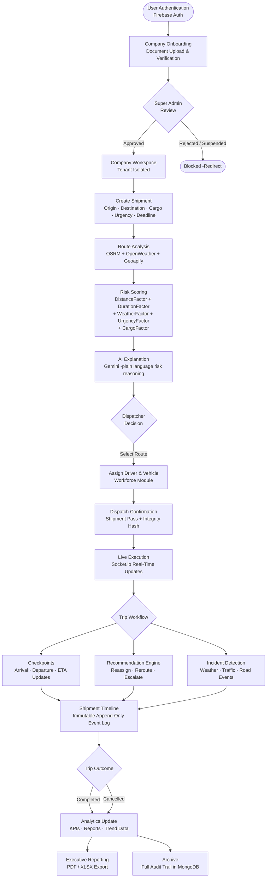

# Architecture

SentinelRoute's runtime is composed of several cooperating engines. Each has a clear responsibility boundary and communicates through well-defined interfaces.

**Related:** [Modules](modules.md) · [Real-Time](real-time.md) · [Database](database.md) · [AI Engine](ai-engine.md) · [Back to README](../README.md)

---

## Platform Workflow



---

## Module Dependency Graph

The module dependency chain is strictly layered. Higher modules consume lower module APIs but never modify lower module code.

```
Module 1 (Auth + Company)
  └── Module 2 (Workforce)
        └── Module 4 (Assignment)
              └── Module 5 (Execution)
  └── Module 3 (Operational Intelligence)
        └── Module 6 (Recommendations)
              └── Module 7 (Real-Time)
                    └── Module 8 (Collaboration)
  └── Module 9 (Analytics)
  └── Module 10 (Operational Feed)
  └── Module 11 (Settings)
```

---

## Engine Descriptions

### Event Dispatcher

The Socket.io server (`src/lib/socket-server.ts`) is initialized once per Node.js process. It maintains a single namespace and provides typed emit helpers (`emitShipmentCreated`, `emitShipmentUpdated`). On the client, `useSocket` manages a single connection instance with automatic reconnection and typed event handler registration.

Company rooms (`company:{companyId}`) are the primary scoping unit. When a user connects, the client emits `join:company` and the server places the socket into the company room. All broadcast events are emitted to the company room, ensuring tenant isolation at the transport layer.

### Operational Engine

The Operational Engine (`/api/operational/feed` and `/api/operational/health`) aggregates live state from the incidents, alerts, recommendations, and shipments collections into a feed and a health score. Feed items are time-ordered. The health score is computed from six sub-components and mapped to a five-tier label. Both are pushed to connected clients via Socket.io when state changes.

### Recommendation Engine

The Recommendation Engine generates typed `OperationalRecommendation` documents when risk conditions are detected. Each recommendation has a `type` (from a 10-value enum), `reason`, `confidence` (0–100), `affectedMetrics`, `tradeoffs`, `estimatedImpact`, and `severity`. The lifecycle state machine transitions the recommendation from `generated` through to `completed` or `expired`. Every transition is written to the shipment timeline.

### Risk Engine

The Risk Engine (`src/lib/risk.ts`) is deterministic and stateless. Given `(distanceKm, durationHours, weatherFactor, deadline, cargoType)`, it always produces the same `riskScore` and `riskLevel`. No random values, no AI involvement in the scoring formula. Scores are reproducible and auditable by design.

```
riskScore = distanceFactor + durationFactor + weatherFactor + urgencyFactor + cargoFactor

distanceFactor  = distanceKm × 0.02
durationFactor  = durationHours × 0.5
urgencyFactor   = 5 (<24 h) | 3 (24–72 h) | 1 (≥72 h)
cargoFactor     = 4 (fragile) | 1 (standard)
```

### Health Score

The `OperationalHealthScore` aggregates six real-time inputs -active shipments, average risk, driver availability, vehicle availability, incident density, and route confidence -into a single 0–100 score with a five-tier label: Excellent, Good, Fair, Poor, Critical.

### Socket Layer

The Socket.io server runs on a custom Node.js HTTP server (`server.ts`) in development. In production on Vercel, the WebSocket path `/api/socket` is proxied. The client uses a singleton socket instance across the application lifetime and falls back to 30-second polling when the WebSocket is unavailable.

### Store

`StoreContext` (`src/lib/store.tsx`) is a `useReducer`-based client state container. It holds shipments, pending shipment, operational feed, operational health, presence map, and KPI data. All mutations flow through API calls. Socket events trigger reducer dispatches directly -no optimistic updates. The store includes resilient `fetchWithAuth` with a 9-second timeout, single retry on network errors and 5xx responses, and token refresh on 401.

---

## Enterprise Design Principles

### Single Source of Truth

MongoDB is the sole persistent data store. No module-level arrays, no in-memory caches, no stale client data. Every read is sourced from MongoDB or propagated from a socket event that was emitted after a confirmed MongoDB write.

### Event Driven

Every state mutation emits a corresponding Socket.io event after the MongoDB write is confirmed. The client state is updated exclusively through these events or explicit API fetches. The event bus is the integration mechanism between server writes and client state.

### Modular

Eleven independent modules built in sequence with strict additive rules. Later modules consume earlier module APIs but never modify earlier module files. Each module can be reasoned about independently.

### Composable

The type system in `src/lib/types.ts` is the shared contract between all modules. Components are composed from Shadcn UI primitives. API handlers are composed from auth helpers, validation schemas, and data access functions.

### Immutable Timeline

The shipment timeline and audit logs are append-only. History is never rewritten. This gives the platform a tamper-evident operational record that can be audited at any point.

### Predictive Intelligence

Risk scoring and route confidence are computed before dispatch, not after failure. The Recommendation Engine surfaces operational decisions before they become incidents.

### Decision First

The Decision Workspace is structured to give dispatchers all the information they need -risk scores, AI explanations, active recommendations, route comparisons -before committing to a dispatch. Decisions are informed, not reactive.

### Operational Awareness

The Command Center, Operational Feed, Health Score, and Risk Center give operations managers a continuous, live view of company-wide state. No context switching needed to understand the current operational posture.

---

## Google Ecosystem Scale-Up Path

SentinelRoute is designed to transition into a Google-native logistics SaaS platform capable of serving enterprise fleets, high shipment volumes, and multi-region operations.

| Layer | Google Ecosystem Upgrade | Strategic Value |
|---|---|---|
| **Cloud Platform** | Google Cloud Platform | Unified enterprise infrastructure |
| **Compute** | Cloud Run | Auto-scaling containerized backend services |
| **API Management** | API Gateway | Secure, monitored external integrations |
| **Database** | Firestore + BigQuery | Real-time operational data + large-scale analytics |
| **Maps Intelligence** | Google Maps Platform | Premium routing, traffic intelligence, ETA precision |
| **AI & Prediction** | Gemini + Vertex AI | Delay prediction, optimization models, decision automation |
| **Storage** | Google Cloud Storage | Documents, shipment proofs, reports, media |
| **Streaming Data** | Pub/Sub | Real-time fleet events and logistics signals |
| **Monitoring** | Cloud Logging, Cloud Monitoring | Production observability and alerting |
| **Identity & Security** | Firebase Auth + IAM + Secret Manager | Enterprise-grade access control and secret management |
| **Global Scale** | Multi-region deployment + CDN | Low-latency global logistics operations |
| **CI/CD** | Cloud Build + GitHub Actions | Automated testing and production releases |
